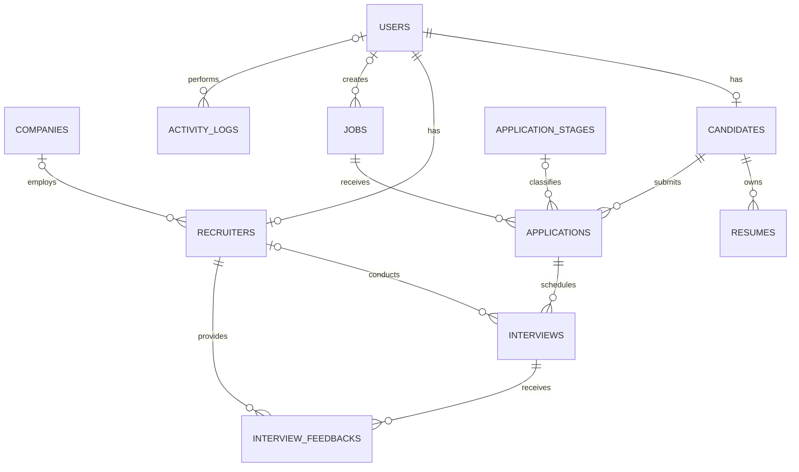

# Applicant Tracking System

A Spring Boot REST API for managing the end-to-end recruitment process. The
system helps recruiters manage jobs, candidates, applications, interviews, and
recruitment metrics while giving candidates a place to discover jobs, apply,
and track their application status.

The project is built with JPA, MySQL, and Clean/Hexagonal Architecture.

## Features
### ADMIN
Administrators manage the entire system.

- User management
  - Create recruiter accounts.
  - Lock or unlock user accounts.
  - Assign roles:
    - ADMIN
    - RECRUITER
    - CANDIDATE
- Company management
  - Create companies.
  - Edit company information.
  - Activate or deactivate companies.
- Dashboard
  - Total number of candidates.
  - Total number of jobs.
  - Total number of recruiters.
  - Total number of hired candidates.
- Audit log
  - Track all actions, including:
    - A recruiter creating a job.
    - A recruiter changing a candidate's status.
    - A recruiter scheduling an interview.
### Recruiter

Recruiters are the primary users of the Applicant Tracking System.

- Create job postings.
- Edit job information.
- Open or close job postings.
- View and manage active and closed jobs.

#### Candidate management

- View a list of candidates with:
  - Full name
  - Email address
  - Phone number
  - CV/resume
  - GitHub profile
  - LinkedIn profile
- Search candidates by:
  - Name
  - Email address
  - Skills

#### Application management

- View applications for each job.
- Move applications between recruitment stages.
- Add recruiter notes.
- View the application change history.
- Track each candidate throughout the hiring pipeline.

#### Interview management

- Schedule interviews with:
  - Title
  - Date and time
  - Google Meet link
  - Physical location
  - Assigned interviewer
- Record feedback after an interview.
- Track interview status and results.

#### Recruitment analytics

- Number of candidates per job.
- Interview pass rate.
- Offer acceptance rate.
- Time-to-hire.

### Candidate

Candidates can create a profile, find suitable opportunities, apply for jobs,
and follow their progress through the recruitment process.

#### Authentication

- Register and sign in with email and password.
- Sign in with Google as an advanced authentication option.

#### Candidate profile

- Upload an avatar.
- Upload a CV/resume in PDF format.
- Add GitHub and LinkedIn profiles.
- Add work experience and professional information.

#### Job discovery

- Browse available job postings.
- Search and filter jobs by:
  - Keyword
  - Location
  - Salary
  - Technology

#### Job application

- Select or upload a CV.
- Write a cover letter.
- Apply for a job.
- Track the current application status.

#### Notifications

Candidates receive notifications when:

- They are invited to an interview.
- They receive an offer.
- Their application is rejected.

## Architecture

The project follows Clean/Hexagonal Architecture:

```text
HTTP request
    |
    v
adapter/controller
    |  REST endpoints, request/response DTOs, validation, exception handling
    v
application/port/in
    |  Inbound use-case contracts
    v
application/service
    |  Business workflow orchestration and transaction management
    v
domain
    |  Business models, enums, and domain exceptions
    v
application/port/out
    |  Persistence contracts independent of Spring Data
    v
infrastructure/persistence/adapter
    |  Mapping between domain models and JPA entities
    v
infrastructure/persistence/repository
    |  Spring Data JPA repositories
    v
MySQL
```

### Package structure

| Package | Responsibility |
|---|---|
| `adapter.controller` | REST APIs, endpoint DTOs, and exception handling |
| `adapter.request`, `adapter.response` | Request and response models |
| `application.port.in` | Use-case interfaces called by inbound adapters |
| `application.service` | Business logic, transactions, and orchestration |
| `application.port.out` | Data-access interfaces required by the application |
| `domain.model` | Framework-independent business models and enums |
| `domain.exception` | Business and domain exceptions |
| `infrastructure.persistence.adapter` | Output-port implementations and data mapping |
| `infrastructure.persistence.entity` | JPA table and relationship mappings |
| `infrastructure.persistence.repository` | Spring Data JPA repositories |
| `infrastructure.config` | Security, file upload, and static-resource configuration |

## Technology Stack

| Technology | Version | Purpose |
|---|---:|---|
| Java | 17 | Programming language and runtime |
| Maven Wrapper | 3.9.16 | Build and dependency management |
| Spring Boot | 3.5.7 | Application framework |
| Spring Web / MVC | 6.2.12 | REST APIs and public file serving |
| Spring Data JPA | 3.5.5 | Persistence abstraction |
| Hibernate ORM | 6.6.33.Final | JPA implementation |
| Jakarta Persistence API | 3.1.0 | Persistence API and annotations |
| Jakarta Validation API | 3.0.2 | Request validation |
| Spring Security | 6.5.6 | Security filters and password encoding |
| Spring WebSocket | 6.2.12 | Real-time communication dependency |
| OAuth2 Resource Server | 6.5.6 | JWT and OAuth2 resource-server support |
| MySQL Server | 8.4 | Relational database |
| MySQL Connector/J | 9.4.0 | JDBC driver |
| Lombok | 1.18.42 | Boilerplate code generation |
| JUnit Jupiter | 5.12.2 | Testing framework |
| Mockito | 5.17.0 | Mocking framework |

> WebSocket and OAuth2 dependencies are included in the project, but their
> complete application flows are not configured yet.

## Database Relationships



### Relationship Details

| Relationship | Cardinality | Foreign key | Description |
|---|---|---|---|
| Company to Recruiter | `1 - 0..N` | `recruiters.company_id` | A company can employ multiple recruiters; assigning a company to a recruiter is optional |
| User to Candidate | `1 - 0..1` | `candidates.user_id` | A candidate profile belongs to one user, and a user can have at most one candidate profile |
| User to Recruiter | `1 - 0..1` | `recruiters.user_id` | A recruiter profile belongs to one user, and a user can have at most one recruiter profile |
| User to Job | `1 - 0..N` | `jobs.created_by` | A user can create multiple jobs; assigning a creator to a job is optional |
| User to Activity Log | `1 - 0..N` | `activity_logs.user_id` | A user can perform multiple logged activities; the user reference is optional |
| Candidate to Resume | `1 - 0..N` | `resumes.candidate_id` | A candidate can own multiple resumes, and every resume must belong to one candidate |
| Candidate to Application | `1 - 0..N` | `applications.candidate_id` | A candidate can submit multiple applications, and every application must belong to one candidate |
| Job to Application | `1 - 0..N` | `applications.job_id` | A job can receive multiple applications, and every application must target one job |
| Application Stage to Application | `1 - 0..N` | `applications.stage_id` | A stage can classify multiple applications; assigning a stage is optional |
| Application to Interview | `1 - 0..N` | `interviews.application_id` | An application can have multiple interviews, and every interview must belong to one application |
| Recruiter to Interview | `1 - 0..N` | `interviews.interviewer_id` | A recruiter can conduct multiple interviews; assigning an interviewer is optional |
| Interview to Feedback | `1 - 0..N` | `interview_feedbacks.interview_id` | An interview can receive multiple feedback entries, and each entry belongs to one interview |
| Recruiter to Feedback | `1 - 0..N` | `interview_feedbacks.reviewer_id` | A recruiter can provide multiple feedback entries, and every entry must have one reviewer |

The `applications` table is the junction between `candidates` and `jobs`. It
resolves their many-to-many relationship into two one-to-many relationships
and stores each application's current recruitment stage.

### Main business constraints

- The pair `applications(candidate_id, job_id)` is unique, so a candidate
  cannot apply to the same job more than once.
- `application_stages.name` and `application_stages.position` are unique.
- `years_of_experience` must be zero or greater.
- `salary_min` must not exceed `salary_max` when both values are present.
- Interview feedback ratings must be between `1` and `5`.
- Deleting a candidate also deletes all of their resumes (`CASCADE`).
- Deleting an application deletes its interviews, and deleting an interview
  deletes its feedback (`CASCADE`).
- Candidates and jobs with existing applications cannot be deleted
  (`RESTRICT`).
- Deleting a user preserves related jobs, interviews, and activity logs while
  setting their corresponding foreign keys to `NULL`.

## Getting Started

### Prerequisites

- Java 17
- Docker and Docker Compose, or a local MySQL 8 database

### Start MySQL

```bash
docker compose up -d
```

### Run the application

On Windows:

```bash
.\mvnw.cmd spring-boot:run
```

On macOS or Linux:

```bash
./mvnw spring-boot:run
```

The API starts at `http://localhost:8080`.

### Configuration

The application supports the following environment variables:

| Variable | Default value | Description |
|---|---|---|
| `SERVER_PORT` | `8080` | HTTP server port |
| `DB_URL` | `jdbc:mysql://localhost:3306/ats` | JDBC connection URL |
| `DB_USERNAME` | `root` | Database username |
| `DB_PASSWORD` | `123456` | Database password |
| `MAX_UPLOAD_SIZE` | `10MB` | Maximum uploaded file size |
| `UPLOAD_DIR` | `D:/uploads` | Local file-storage directory |

## Testing

The following testing rules apply to this project:

- Do not generate or add automated test code.
- Running the test suite is not required.
- Development tasks should be completed without creating or executing tests.
